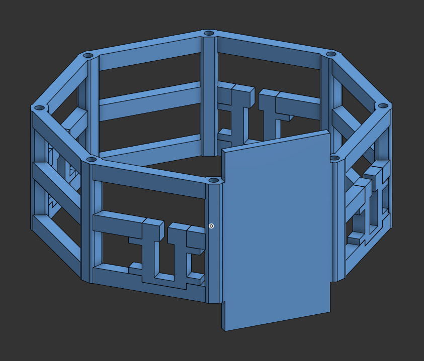

## 12-10-2025: Creating the new CAD model

Today I've set up a new Onshape document for the new design. I've made a main part studio that includes sketches that other modules might derive. It also has carbon fiber rods that all modules attach to.

I've made 3 part studios, one for each module. I'm starting by remaking the propulsion module and this is what I've done so far:

**Time spent: 35min**

## 15-10-2025: Starting the propulsion module

I noticed a circular structure might be better for the propulsion module, because the motor will be mounted on its center and it's better if the clearance between the propeller and the structure is constant.

I changed the design to use a circle and I added attachments for the carbon fiber rods:

I then added the redesigned airflow straighteners, which will also support the motor and the LiDAR.

Next, I added mounts for the ESCs:

Finally, I added the battery mounts:

**Time spent: 1h 1min**

Update video:

## 16-10-2025

Today I started working on the guidance module. I've made a structure with attachments for the rods and for the PCB.

Next, I added servo attachments. These servos will control the deployment of the landing legs.

I then started the design of the control module. I've added rod attachments and servo mounts as well. These servos will control the thrust vector of the motor that will sit above on this same module.

After that, I've set up an assembly that joins all modules and the carbon fiber rods.

Next I've added attachments for the landing legs on the propulsion module:

After that, I've added an attachment for a LiDAR at the bottom:

Finally, I added the motor mount on the propulsion assembly and I added fillets on everything. The propulsion assembly is almost finished!

**Time spent: 2h 27min**

## 17-10-2025

I added a motor mount on the control assembly.

![[Pasted image 20251017144351.png]]

Next, I added the servos to the guidance assembly. These will control the deployment of the landing legs.

![[Pasted image 20251017160739.png]]

I then added the servos and TVC (Thrust Vector Control) vanes to the control assembly. These servos control the direction of the airflow from the motor to steer the rocket.

![[Pasted image 20251017184424.png]]

Next, I made the landing legs

![[Pasted image 20251017194726.png]]

![[Pasted image 20251017194844.png]]

After that, I added some foam to reduce vibrations on deployment

![[Pasted image 20251017225513.png]]

